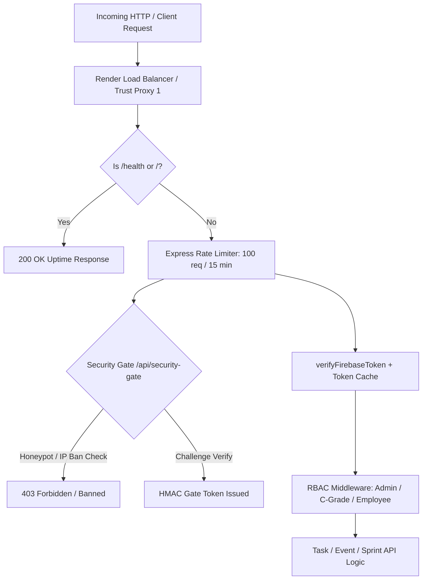
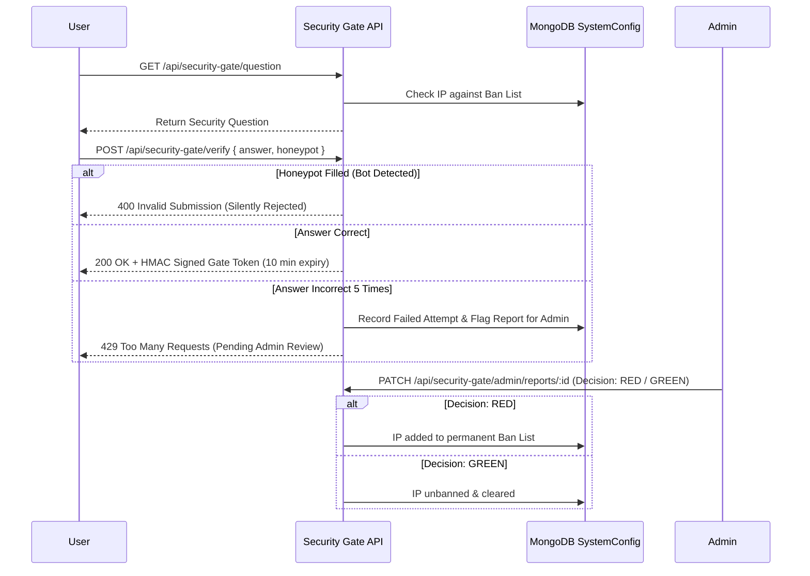
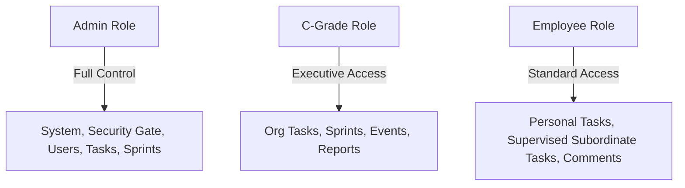

# KanbaKan — In-Depth Security & Application Features Report

This report provides an exhaustive technical overview of the security architecture, security enhancements, core application capabilities, and Role-Based Access Control (RBAC) permissions matrix implemented in the **KanbaKan** platform.

---

## 1. Executive Summary

**KanbaKan** is an organization-grade Kanban task management system designed for teams of 20 to 30 people. Built on Express.js, MongoDB (Mongoose), Firebase Authentication, and Vite/React with TypeScript, the system combines real-time planning, deadline automation, organizational hierarchy tracking, and multi-layered security controls.

---

## 2. Comprehensive Security Architecture & Features

The platform employs a **defense-in-depth** strategy spanning network protection, authentication, token validation, bot prevention, rate limiting, and access control.

### A. Network & Request Protection
> [!NOTE]
> All incoming traffic passes through strict request headers and IP-trust configuration before reaching API handlers.

* **Reverse Proxy Trust (`app.set('trust proxy', 1)`)**:
  * Configured Express to trust Render load balancer proxies.
  * Correctly extracts client IPs from `x-forwarded-for` headers, preventing global rate-limit triggers where all users were previously aggregated into a single server IP.
* **Health Check Rate Limit Exemption**:
  * Placed public `/health` and `/` endpoints **before** rate limiter middleware.
  * Allows external keep-alive cron jobs (e.g., `cron-job.org`) to ping `/health` without consuming API rate-limit quotas or triggering `429 Too Many Requests`.
* **Helmet Security Headers**:
  * **Content Security Policy (CSP)**: Restricts script/connect sources strictly to authorized Firebase, Google APIs, Vercel, and Render origins.
  * **Frameguard (`action: 'deny'`)**: Completely blocks clickjacking and framing attempts.
  * **MIME Sniffing Protection (`noSniff: true`)**: Prevents browsers from guessing non-executable file types into executable code.
  * **Referrer Policy (`strict-origin-when-cross-origin`)**: Protects token and path privacy during cross-site requests.
* **Cross-Origin Resource Sharing (CORS)**:
  * Strict dynamic origin validation supporting local development (`localhost:5173`, `localhost:5174`) and production Vercel previews (`*.vercel.app`).
  * Explicit OPTIONS preflight handler with cached `Access-Control-Max-Age: 86400`.
* **Multi-Tiered Rate Limiting (`express-rate-limit`)**:
  * **General API Limiter**: 100 requests per 15-minute window per IP.
  * **Reporting Limiter**: 20 requests per 15-minute window for resource-intensive PDF/CSV generation.

---

### B. Authentication & Token Security
* **Firebase Admin Authentication**:
  * All protected `/api/*` endpoints require a valid `Authorization: Bearer <id_token>` header verified against Firebase Admin SDK.
* **Server-Side User Caching**:
  * In-memory cache with 5-minute TTL (`USER_CACHE_TTL`) maps Firebase `uid` to MongoDB `_id` and `role`.
  * Reduces MongoDB database queries on every authenticated request while ensuring instant cache clearing on account deletion via `clearUserCache(uid)`.

---

### C. Security Gate System (Bot & Intrusion Shield)
> [!IMPORTANT]
> The Security Gate acts as an interactive verification checkpoint protecting sensitive operations from unauthorized automated access.

1. **Honeypot Trap**:
   * Contains an invisible form field `company_website_url`. Spambots and automated scrapers that autofill this field are silently rejected immediately (`400 Invalid Submission`).
2. **SHA-256 Hashed Answers**:
   * Verification answers are normalized (lowercase, whitespace stripped) and hashed using SHA-256 (`hashAnswersList`). Plain-text answers are never hardcoded or exposed in DB payloads.
3. **HMAC-Signed Gate Tokens (`x-gate-token`)**:
   * Successful gate verification generates an HMAC-SHA256 signed token valid for 600 seconds (10 minutes). Protected endpoints verify this token via `verifyGateTokenHeader`.
4. **Automated 5-Attempt Failure Threshold & Admin Report Queue**:
   * If an IP fails verification 5 times within 15 minutes, the system logs a report containing IP address, timestamp, and user agent, and pauses further attempts from that IP pending admin review.
5. **Admin Security Gate Panel & RED/GREEN Decision Workflow**:
   * Admins can inspect flagged intrusion reports in real time.
   * **RED Decision**: Bans the offending IP address permanently (`banList`).
   * **GREEN Decision**: Clears the report and restores IP access.
   * Admins can dynamically change the security question and acceptable answer choices from the dashboard.

---

### D. Data Integrity & Concurrency Controls
* **Optimistic Concurrency Control (OCC)**:
  * Task updates enforce `updatedAt` checking (`Task.findOneAndUpdate({ _id, updatedAt })`). If another user edited the task simultaneously, a `409 Conflict` error is returned to prevent overwrite collisions.
* **Soft Deletes (`isDeleted: true`)**:
  * Tasks are never deleted permanently from MongoDB upon user deletion; they are marked with `isDeleted: true` to maintain audit logs and activity histories.
* **FCM Notification Deduplication**:
  * Service worker (`firebase-messaging-sw.js`) checks `!payload.notification` before calling `showNotification()`, preventing mobile phones from showing duplicate/double notifications.

---

## 3. Comprehensive Application Features

| Feature Module | Key Capabilities |
| :--- | :--- |
| **Kanban Task Board** | Dynamic column views (Todo, In Progress, Review, Completed), task priority tagging (Low, Medium, High, Urgent), link attachments, due date pickers, tags. |
| **Personal Dashboard** | Customized task view showing tasks assigned directly to the logged-in user, filtered by status/priority. |
| **Organization Dashboard** | Organization-wide board with hierarchy-aware supervised filtering (`supervisedOnly=true`) for managers. |
| **Sprint Management & Planning Hub** | Create sprints, activate active sprint, close completed sprints, view sprint velocity, assign tasks to sprints. |
| **Chain of Command (COC) Tree** | Interactive organizational chart visualizer showing direct and nested subordinate relationships. |
| **Deadlines & Interactive Calendar** | Monthly/weekly calendar view of task due dates and scheduling events. |
| **Automated Deadline Alerts** | Server-side background cron (`node-cron`) checking every hour for tasks due within 24 hours, sending push notifications to assignees. |
| **Activity Log & Comment History** | Full task audit trail recording status changes, reassignments, user comments, and timestamps. |
| **Reporting & Analytics Hub** | Export task completion reports, team productivity statistics, and sprint metrics to CSV and PDF formats with rate-limited protection. |
| **Push Notifications (FCM)** | Cross-device Firebase Cloud Messaging for task assignments, reassignments, deadline warnings, and security alerts. Single-notification handling for mobile devices. |
| **Profile & Settings** | Custom username setup, superior selection, theme switching (Light/Dark mode), and self account deletion (purges Firebase Auth & Mongo user). |
| **PWA & Mobile Install** | Progressive Web App support with service worker registration and custom PWA installation banner (`InstallPWA`). |

---

## 4. Role-Based Access Control (RBAC) Permissions Matrix

The platform defines three primary roles: **Admin**, **C-Grade (Executive Management)**, and **Employee (Standard User)**.

### Complete RBAC Matrix ("Which Kind of User Can Do What")

| Capability / Action | Unauthenticated / Guest | Employee (Standard) | C-Grade (Executive) | Admin |
| :--- | :---: | :---: | :---: | :---: |
| **View Public Security Gate Question** | `ALLOWED` | `ALLOWED` | `ALLOWED` | `ALLOWED` |
| **Submit Security Gate Challenge** | `ALLOWED` | `ALLOWED` | `ALLOWED` | `ALLOWED` |
| **View Health Check (`/health`)** | `ALLOWED` | `ALLOWED` | `ALLOWED` | `ALLOWED` |
| **Log In via Firebase Auth** | `ALLOWED` | `ALLOWED` | `ALLOWED` | `ALLOWED` |
| **View Own Personal Tasks** | `DENIED` | `ALLOWED` | `ALLOWED` | `ALLOWED` |
| **Create New Task** | `DENIED` | `ALLOWED` | `ALLOWED` | `ALLOWED` |
| **Edit Task Created By Self** | `DENIED` | `ALLOWED` | `ALLOWED` | `ALLOWED` |
| **Edit Task Assigned To Self** | `DENIED` | `ALLOWED` | `ALLOWED` | `ALLOWED` |
| **Edit Task Created By/Assigned to Subordinates** | `DENIED` | `ALLOWED` | `ALLOWED` | `ALLOWED` |
| **Edit Unrelated Task (Outside Hierarchy)** | `DENIED` | `DENIED` | `ALLOWED` | `ALLOWED` |
| **Update Task Status (Owner / Assignee)** | `DENIED` | `ALLOWED` | `ALLOWED` | `ALLOWED` |
| **Reassign Task to Different User** | `DENIED` | `DENIED` | `DENIED` | `ALLOWED` |
| **Soft-Delete Task** | `DENIED` | `ALLOWED` (Own/Sub) | `ALLOWED` | `ALLOWED` |
| **Add Comment / View Activity History** | `DENIED` | `ALLOWED` | `ALLOWED` | `ALLOWED` |
| **View Supervised Tasks (`supervisedOnly=true`)** | `DENIED` | `ALLOWED` (Subordinates) | `ALLOWED` (All) | `ALLOWED` (All) |
| **View Chain of Command (COC) Tree** | `DENIED` | `ALLOWED` | `ALLOWED` | `ALLOWED` |
| **Create & Manage Events / Calendar** | `DENIED` | `ALLOWED` | `ALLOWED` | `ALLOWED` |
| **Create, Activate, Close Sprints** | `DENIED` | `ALLOWED` | `ALLOWED` | `ALLOWED` |
| **Generate & Export CSV/PDF Reports** | `DENIED` | `ALLOWED` | `ALLOWED` | `ALLOWED` |
| **Update Own Profile (Name, Username, Superior)** | `DENIED` | `ALLOWED` | `ALLOWED` | `ALLOWED` |
| **Register FCM Device Token** | `DENIED` | `ALLOWED` | `ALLOWED` | `ALLOWED` |
| **Delete Own Account** | `DENIED` | `ALLOWED` | `ALLOWED` | `ALLOWED` |
| **List All Registered Users** | `DENIED` | `DENIED` | `ALLOWED` | `ALLOWED` |
| **Change User Role (Promote/Demote)** | `DENIED` | `DENIED` | `DENIED` | `ALLOWED` |
| **Issue Official Warning to User (`isWarned`)** | `DENIED` | `DENIED` | `DENIED` | `ALLOWED` |
| **Assign/Update User Superior** | `DENIED` | `DENIED` | `DENIED` | `ALLOWED` |
| **Delete Any User Account** | `DENIED` | `DENIED` | `DENIED` | `ALLOWED` |
| **Access Admin Security Gate Config** | `DENIED` | `DENIED` | `DENIED` | `ALLOWED` |
| **Update Security Question & Answer Hashes** | `DENIED` | `DENIED` | `DENIED` | `ALLOWED` |
| **View IP Intrusion Reports & Ban List** | `DENIED` | `DENIED` | `DENIED` | `ALLOWED` |
| **Review & Approve/Ban IPs (RED/GREEN Decisions)** | `DENIED` | `DENIED` | `DENIED` | `ALLOWED` |

---

## 5. Summary of Recent Improvements Made

1. **Keep-Alive & Health Check Optimization**:
   * Placed `/health` route before rate limiters with `trust proxy: 1`, allowing Render keep-alive pings to maintain server warm-state cleanly.
2. **Push Notification Deduplication**:
   * Enhanced FCM service worker logic (`firebase-messaging-sw.js`) to prevent duplicate notification popups on mobile devices.
3. **Security Gate Failure Review Workflow**:
   * Built persistent IP tracking, automated 5-attempt thresholds, and RED/GREEN administrative review actions for intrusion reports.
4. **Hierarchy-Aware Task Delegation**:
   * Enforced recursive subordinate identification (`getAllSubordinateIds`), allowing managers to view and manage tasks across their chain of command safely.
